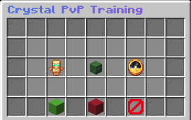

# ✨ T-Train ✨
## 🔮 Advanced Crystal PvP Training for Minecraft

T-Train is a specialized Minecraft plugin designed for competitive players looking to master Crystal PvP techniques. By providing customizable training zombies equipped with totems, this plugin offers a controlled environment to practice combat skills, timing, and strategies essential for high-level PvP. Say goodbye to unpredictable practice sessions and hello to structured improvement!

<p align="center">
  
</p>

## ⚡ Key Features
- **Intuitive Training Interface**: Sleek, modern GUI for easy configuration of your training sessions
- **Customizable Training Zombies**: Control totem count, training duration, and zombie attributes
- **Progression System**: Save personal preferences and track improvement over time
- **World Management**: Configure which worlds allow training sessions
- **Optimized Performance**: Minimal server impact even with multiple training sessions active
- **Visual & Audio Feedback**: Clear indicators and sound effects enhance the training experience

## 📋 Requirements
- Minecraft 1.21+
- Paper/Spigot API
- Java 17+

## 🎮 Commands
| Command | Description |
|---------|-------------|
| `/train` | Opens the main training GUI |
| `/train <totems> <duration>` | Quick-spawns a training zombie with specified settings |
| `/ttrain` | Alias for the train command |

## 🚀 Quick Start Guide
1. **Installation**: Place the jar file in your server's `plugins` folder and restart
2. **First Use**: Type `/train` to open the configuration GUI
3. **Configuration**: Set your desired totems (1-5) and duration (10-300 seconds)
4. **Training**: Click the zombie head to spawn your training zombie
5. **Practice**: Use crystals to attack the zombie and practice timing your hits

## ⚙️ Advanced Configuration
The plugin is extensively configurable through `config.yml`:
```yaml
# Sample configuration (see full file for all options)
zombie:
  max-totems: 5
  health: 40.0
  end-session-on-last-totem: true
training:
  max-duration: 300
  min-duration: 10
  min-totems: 1
```

## 🌍 World Management
Control where training zombies can be spawned:
```yaml
worlds:
  enabled:
    - "world"
    - "training_arena"
  disabled:
    - "spawn"
    - "creative_world"
```

## 🔑 Permissions
- `ttrain.use` - Access to basic commands and GUI
- `ttrain.spawn.command` - Ability to spawn zombies via command
- `ttrain.spawn.gui` - Ability to spawn zombies via GUI
- `ttrain.admin` - Complete administrative access

## 💻 For Developers
T-Train is open source and welcomes contributions. The plugin uses a modern architecture with:
- Clean manager-based design
- Event-driven interactions
- Comprehensive logging system
- Placeholder API integration

## 🤝 Support & Community
Having issues or suggestions? We're here to help:
- GitHub Issues: Report bugs or request features
- Discord: Join our community for tips and discussion

## 📜 License
This project is licensed under the MIT License - see the LICENSE file for details.

---
*✨ T-Train: Perfect your crystal PvP skills one zombie at a time! ✨*
